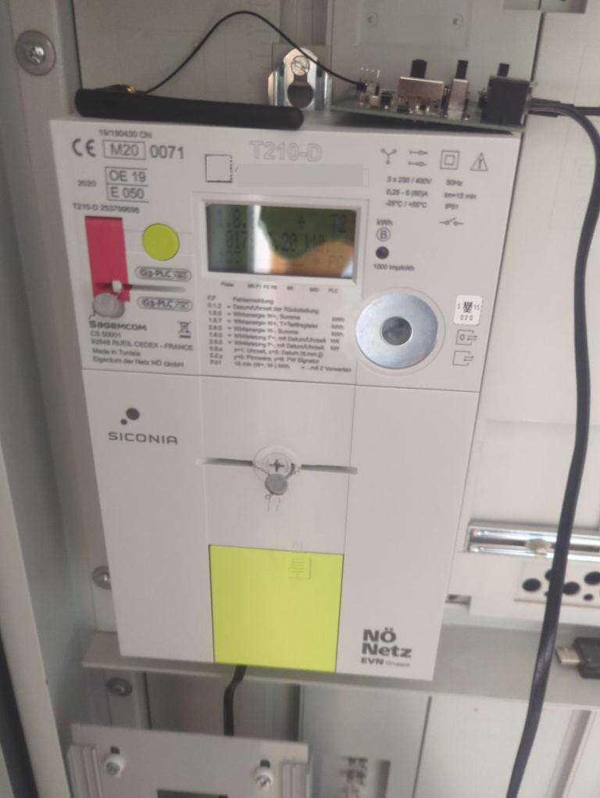

DLMS_Meter Component
====================

.. seo::
    :description: Instructions for setting up DLMS Meter component in ESPHome.
    :image: dlms_meter.jpg

Component
-------------

The DLMS_Meter component connects to Smart Meters which use the encrypted DLMS/Cosem protocol over uart. These smartmeters are used for example everywhere in Austria.

**To use this component an mbus to uart adapter is required!**

You have to get the decrytion key from your energy provider / grid operator.

This component is passive, it does not transmit any data to your equipment, the equipment always transmits
data which this component decodes and updates the configured sensors at the pace the data is received (data is usually sent every 5 seconds by most smartmeters).

    Smartmeter with mbus adapter board to esp32

.. code-block:: yaml

    # Example configuration entry for generic grid operator
    uart:
      rx_pin: GPIO4 # change this to the pin where you connected the mbus adapter board
      baud_rate: 2400
      rx_buffer_size: 1024 # Needed to receive the large packets send by the smart meter

    dlms_meter:
      decryption_key: "36C66639E48A8CA4D6BC8B282A793BBB" # change this to your decryption key!

    sensor:
      - platform: dlms_meter
        voltage_l1:
          name: "Voltage L1"
        voltage_l2:
          name: "Voltage L2"
        voltage_l3:
          name: "Voltage L3"
        current_l1:
          name: "Current L1"
        current_l2:
          name: "Current L2"
        current_l3:
          name: "Current L3"
        active_power_plus:
          name: "Active power taken from grid"
        active_power_minus:
          name: "Active power put into grid"
        active_energy_plus:
          name: "Active energy taken from grid"
        active_energy_minus:
          name: "Active energy put into grid"
        reactive_energy_plus:
          name: "Reactive energy taken from grid"
        reactive_energy_minus:
          name: "Reactive energy put into grid"

    text_sensor:
      - platform: dlms_meter
        timestamp:
          name: "timestamp"

.. collapse:: Example yamls for special grid operators

    NetzNoe / EVN

    .. code-block:: yaml

        # Sample configuration entry for netznow
        uart:
          rx_pin: GPIO4 # change this to the pin where you connected the mbus adapter board
          baud_rate: 2400
          rx_buffer_size: 1024 # Needed to receive the large packets send by the smart meter

        dlms_meter:
          decryption_key: "36C66639E48A8CA4D6BC8B282A793BBB" # change this to your decryption key!
          provider: netznoe # (optional) key - only set if using evn

        sensor:
          - platform: dlms_meter
            voltage_l1:
              name: "Voltage L1"
            voltage_l2:
              name: "Voltage L2"
            voltage_l3:
              name: "Voltage L3"
            current_l1:
              name: "Current L1"
            current_l2:
              name: "Current L2"
            current_l3:
              name: "Current L3"
            active_power_plus:
              name: "Active power taken from grid"
            active_power_minus:
              name: "Active power put into grid"
            active_energy_plus:
              name: "Active energy taken from grid"
            active_energy_minus:
              name: "Active energy put into grid"
            # EVN
            power_factor:
              name: "Power Factor"

        text_sensor:
          - platform: dlms_meter
            timestamp:
              name: "timestamp"
            # EVN
            meternumber:
              name: "meterNumber"

Configuration variables:

- **decryption_key** (**Required**, string, :ref:`templatable <config-templatable>`, 32 characters, case insensitive): The key to decrypt the
  telegrams. Request this from your provider / grid operator.
- **provider** (*Optional*): Your grid operator. Options are

  - ``generic`` (default). Should work for most grid operators.
  - ``netznoe`` for Netz Noe / EVN

Sensor
------

.. note:: Not all sensors are available on all devices. Grid operator specific sensors are listed last.

Configuration variables:

- **voltage_l1** (*Optional*): Voltage Phase 1.

  - All options from :ref:`Sensor <config-sensor>`.

- **voltage_l2** (*Optional*): Voltage Phase 2.

  - All options from :ref:`Sensor <config-sensor>`.

- **voltage_l3** (*Optional*): Voltage Phase 3.

  - All options from :ref:`Sensor <config-sensor>`.

- **current_l1** (*Optional*): Current Phase 1.

  - All options from :ref:`Sensor <config-sensor>`.

- **current_l2** (*Optional*): Current Phase 2.

  - All options from :ref:`Sensor <config-sensor>`.

- **current_l3** (*Optional*): Current Phase 3.

  - All options from :ref:`Sensor <config-sensor>`.

- **active_power_plus** (*Optional*): Active power taken from grid.

  - All options from :ref:`Sensor <config-sensor>`.

- **active_power_minus** (*Optional*): Active power put into grid.

  - All options from :ref:`Sensor <config-sensor>`.

- **active_energy_plus** (*Optional*): Active energy taken from grid.

  - All options from :ref:`Sensor <config-sensor>`.

- **active_energy_minus** (*Optional*): Active energy put into grid.

  - All options from :ref:`Sensor <config-sensor>`.

- **reactive_energy_plus** (*Optional*): Reactive energy taken from grid.

  - All options from :ref:`Sensor <config-sensor>`.

- **reactive_energy_minus** (*Optional*): Reactive energy put into grid.

  - All options from :ref:`Sensor <config-sensor>`.

Netz Noe / EVN

- **power_factor** (*Optional*): Power Factor

  - All options from :ref:`Sensor <config-sensor>`.

Text Sensor
-----------

Configuration variables:

- **timestamp** (*Optional*): Timestamp of the read values (part of data sent by smart-meter)

  - All options from :ref:`Text Sensor <config-text_sensor>`.

Netz Noe / EVN

- **meternumber** (*Optional*): Meternumber of this smart-meter

  - All options from :ref:`Text Sensor <config-text_sensor>`.

See Also
--------

- :apiref:`dlms_meter/dlms_meter.h`
- :ghedit:`Edit`
